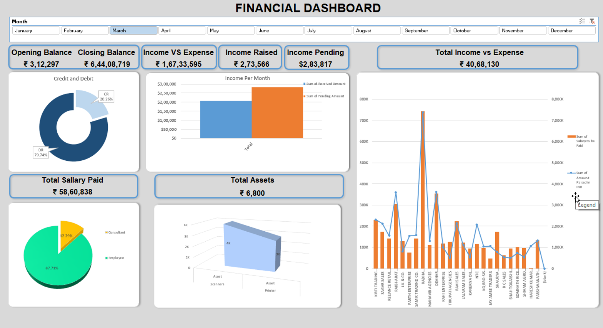

# 💰 Dynamic Financial Dashboard using Google Cloud Platform

A cloud-native solution to automate and visualize financial data for SMEs. This project processes CSV financial data using Google Cloud Functions, stores and queries it in BigQuery, and visualizes it in Looker Studio (formerly Data Studio).

## 📊 Project Architecture



## 🛠️ Technologies Used
- **Google Cloud Functions (2nd Gen)** – Python 3.11
- **Google Cloud Storage** – File ingestion trigger
- **BigQuery** – Data warehouse and SQL transformation
- **Looker Studio** – Interactive dashboards
- **Python** – Data pipeline automation

## ⚙️ How It Works

1. **Trigger**: A `.csv` file uploaded to a Cloud Storage bucket triggers a Cloud Function.
2. **Cloud Function**: 
   - Validates and reads the uploaded file
   - Loads it into BigQuery using defined schema
   - Creates table dynamically if not found
3. **BigQuery**: Performs SQL-based cleaning:
   - Remove rows with invalid SKU format
   - Filter out incorrectly formatted dates
4. **Looker Studio**: Connects to BigQuery and displays interactive charts.

## 🧾 Sample SQL Checks
```sql
-- Date Check
DELETE `project_id.dataset.table`
WHERE Date NOT LIKE '[1-2][0-9][0-9][0-9]/[0-1][0-9]/[0-3][0-9]';

-- SKU Check
DELETE `project_id.dataset.table`
WHERE SKU NOT LIKE '^[0-9]+$';
